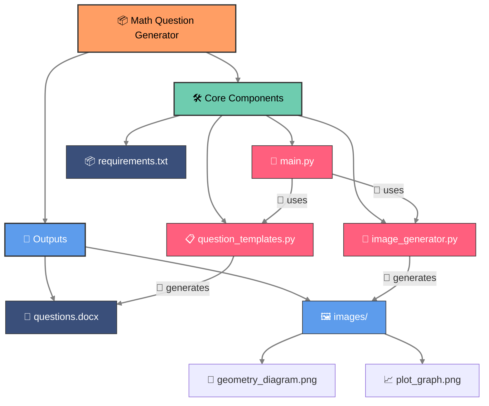

# 📘 Math Question Generator

🧮 A Python project that generates **math assessment questions** in Microsoft Word (`.docx`) format.  
🛠️ Supports **tables, images, LaTeX-style math**, and structured metadata.  
🎯 Ideal for creating exam papers, practice tests, or e-learning content.

---

## ✨ Features
- 📄 **Automatic Word Document Creation** (`.docx`)
- 🗂️ **Supports clean, grid-style tables**
- 📐 **Adds diagrams/images** for geometry questions
- 🔘 **Multiple Choice Questions (MCQ) formatting**
- 🏷️ **Includes subject, unit, topic, difficulty, and marks**
- 🚀 Easy to extend with new questions
- 🛡️ Robust **error + permission handling**
- ✨ Professional formatting with headings, captions, and alignment

---

## 🏗️ Architecture Diagram

## 📤 Output

- **`outputs/questions.docx`** → Final questions document
- **`outputs/images/diagram.png`** → Diagram for geometry question

---

## 🧩 Example Generated Content

### ❓ Question 1 — Combinatorics
**👕 Shirt/👖 Pants/👔 Tie color combination table (MCQ format)**

| 👕 Shirt Color | 👖 Pants Color | 👔 Tie Color |
|---------------|---------------|-------------|
| White         | Black         | Red         |
| Blue          | Navy          | Blue        |
| Gray          | Khaki         | Green       |
| Yellow        | -             | Yellow      |

### ❓ Question 2 — Algebra
**Solve for x:**  
`x² + 5x + 6 = 0`  
**🔍 Solution:** `x = -2` or `x = -3`

### ❓ Question 3 — Geometry
**📐 Calculate the area of the triangle:**  
- 🔼 Base = 5 units  
- 📏 Height = 7 units  
- 🧮 **Area** = ½ × base × height = `17.5 units²`
